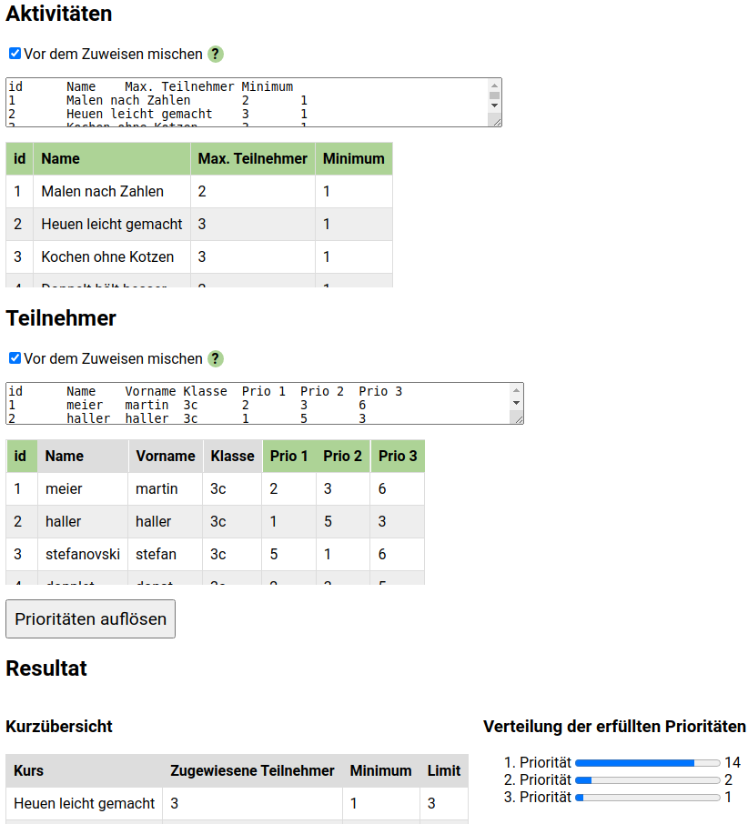

# activity-matcher
## What does it do?!
It is a common scenario in schools, companies etc to have an event/project week etc where 
people can take part in various activities. The number of people that can take part in an activity is (usually) limited.
So organizers get the people to let them know their priorities/preferences regarding the activities they want to participate in.
Then, in the worst case, somebody manually matches activities and participants according to their preferences. 

That last step is where activity-matcher comes in: 

Given that you feed it an Excel file containing two worksheets (activites and participants, details see below) it takes care of 
matching participants and activities and shows you the result. 

## Screenshot
<a href="doc/demo.png">
    
</a>

## Prerequisites, i.e. how does the Excel file look like?

activity-matcher expects an Excel file containing two worksheets:

*NOTE: naming of worksheets and columns is not important*

Activities, with the following columns:
- ID
- Name
- Maximum number of participants

Participants, with the following columns:
- ID
- Name 
- Firstname
- Class (for now, at least)
- n priorities (referring to activities using their ID)

## Build and run it yourself
In order to run it locally run
```
yarn
```
and then either
```
yarn run dev-server
```
or if you are running docker:
```
sh build.sh && sh deploy.sh
```

## Built with
- [js-xlsx](https://github.com/SheetJS/js-xlsx)
- [vue.js](https://github.com/vuejs/vue)
- [webpack](https://github.com/webpack/webpack)
- [babel](https://github.com/babel/babel)